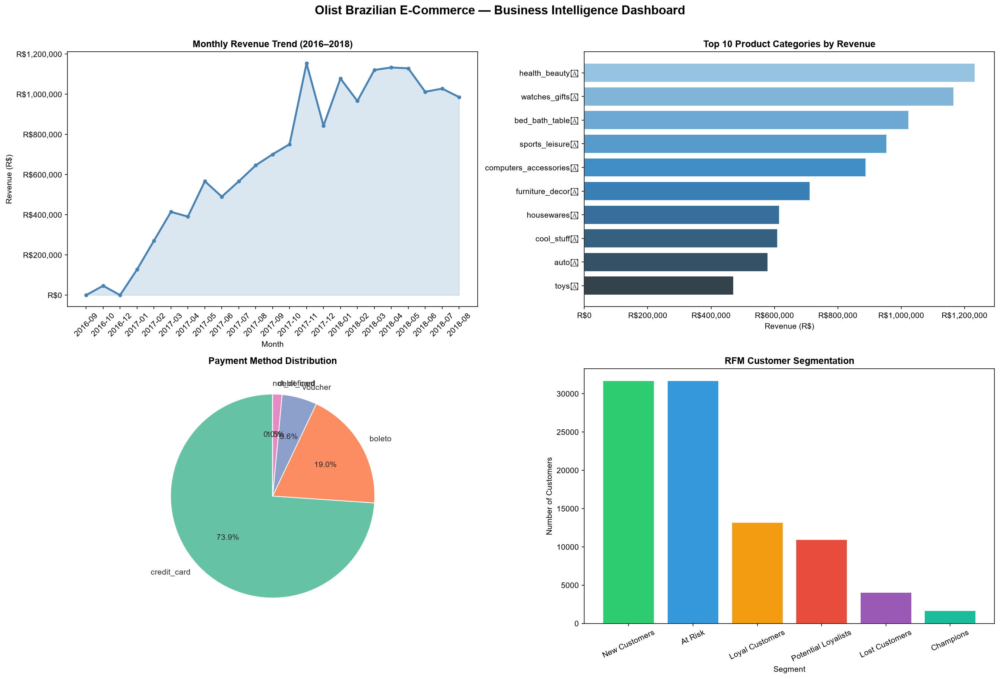

# 🛒 Olist Brazilian E-Commerce — SQL Business Intelligence Analysis

!

##  Project Overview
End-to-end SQL analysis on 100K+ real e-commerce orders from Olist,
Brazil's largest marketplace. Extracts actionable business insights
covering revenue trends, customer segmentation (RFM), product
performance and advanced window functions.

**Tech Stack:** MySQL 8.0 · Python · Pandas · Matplotlib · Seaborn

---

##  Dataset
[Olist Brazilian E-Commerce — Kaggle](https://www.kaggle.com/datasets/olistbr/brazilian-ecommerce)
- 9 tables · 100K+ orders · Sep 2016 – Oct 2018

---

##  Project Structure
```
├── sql/
│   ├── 01_schema_setup.sql
│   ├── 02_data_quality.sql
│   ├── 03_revenue_analysis.sql
│   ├── 04_customer_behaviour.sql
│   ├── 05_product_performance.sql
│   ├── 06_rfm_segmentation.sql
│   └── 07_window_functions.sql
├── olist_analysis.py
├── olist_dashboard.png
└── business_recommendations.txt
```

---

##  Key insights

| # | Finding | Impact |
|---|---------|--------|
| 1 | Revenue grew **10x in 2017**, stabilised at **R$1M+/month** in 2018 | High |
| 2 | Only **3.48% repeat rate** — critical retention problem | High |
| 3 | **São Paulo = 42%** of customers — geographic concentration risk | Medium |
| 4 | **Black Friday +53.55%** spike — biggest revenue opportunity | High |
| 5 | **Freight = 14.3%** of revenue — customer pain point | Medium |
| 6 | **Office furniture** worst rated category (3.52★, 25.4% bad reviews) | Medium |
| 7 | **73.9%** pay by credit card with avg **3.5 installments** | Low |

---

## 🔍 SQL Concepts Used
- Multi-table JOINs (4 tables)
- CTEs (Common Table Expressions)
- Window Functions: RANK, DENSE_RANK, LAG, NTILE, SUM OVER
- RFM Customer Segmentation
- DATE_FORMAT, DATEDIFF, CASE WHEN
- Subqueries & aggregations

---

## 💡 Business Recommendations
1. **Launch loyalty program** targeting 31,703 At-Risk customers
2. **Expand to North Brazil** — untapped market beyond SP/RJ/MG
3. **Free shipping at R$150** to increase average order value
4. **Black Friday prep 6 weeks early** — pre-stock top categories
5. **Furniture packaging standards** to reduce 25% bad review rate


 